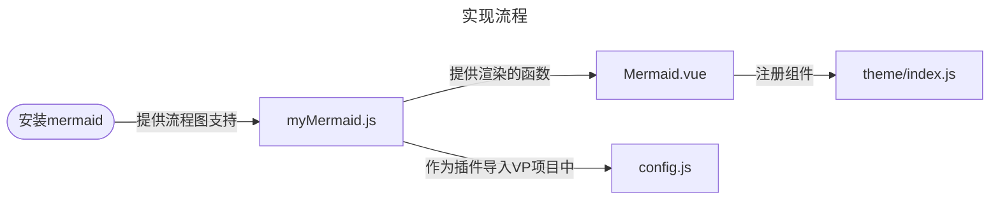
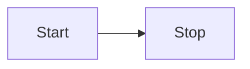

 
###### 24090601
 
<br/>
 
# vitepress 中使用 mermaid 流程图

## 原文参考

::: info <Badge type='info'>参考文章</Badge>

**链接：** https://whlit.github.io/blog/vitepress-mermaid.html  

**介绍：** 原作者是用ts语法写的，非常简洁，水平高的朋友可以直接去原文阅览

:::

👆
**建议先看原文，看不懂，或者迷惑了再看下文，因为本文比较啰嗦**

## 0. 前置基础

::: details 你可能需掌握的知识
- 掌握基本的 es6 语法
- 会，或者想用 markdown 语法来实现流程图
- 了解基本的vue组件知识
:::

## 1. 实现方式


::: info
🔘 **vitepress** 是基于 `markdown-it` 实现的MD代码样式的渲染，所以可以通过编写插件的方式引入与集成 `mermaid` 来实现流程图的功能。  
🔘 **mermaid** 简而言之，是 `markdown` 的一种扩展语法  

:::

<br/>

<Badge type='info'>本文的实现思路</Badge>  

<br/>

<br/>



<br/>


---

::: details 相关
- [vitepress 的相关说明与插件配置](https://vitepress.dev/zh/guide/markdown#advanced-configuration){target="_blank"}  
- [mermaid 文档](https://mermaid.js.org/){target="_blank"}
:::


## 2. 安装依赖

因为 `vitepress` 自带 `markdown-it` 所以只需要额外安装 `mermaid` 的依赖

::: code-group

```js [npm]
npm i mermaid
```
```js [pnpm]
pnpm i mermaid
```
:::

## 3. 自定义插件脚本

你可以在 `.vitepress` 目录下新建一个 `myscript` 文件夹  

当然，你可以放在任何你喜欢的位置，但请记住它的位置

然后新建插件脚本 `myMermaid.js`

<br/>


```js
// 使用安装的依赖 mermaid 
import mermaid from 'mermaid'

// 这个函数是拿给我们自定义的组件调用的：（ mermaid.vue 中调用）
// 将符合 mermaid 语法的代码转化为可视化的流程图
export async function render(id, code) {
    mermaid.initialize({ startOnLoad: false })
    const { svg } = await mermaid.render(id, code)
    return svg
}

// 这个函数是就是我们的插件逻辑 ：（ config.js/ts 中调用）
export default function mermaidPlugin(md) {

    const fence = md.renderer.rules.fence?.bind(md.renderer.rules)

    md.renderer.rules.fence = (tokens, idx, options, env, self) => {
        const token = tokens[idx]
        const language = token.info.trim()

        // 当代码块语言为 mermaid 时 ，让我们的自定义组件成渲染流程图
        if (language.startsWith('mermaid')) {
            return `<Mermaid id="mermaid-${idx}" code="${encodeURIComponent(token.content)}"></Mermaid>`
        }

        return fence(tokens, idx, options, env, self)
    }
}

```

## 4. 自定义组件

注意：  
① 组件中通过导入的脚本，实现转化与渲染，一定别弄错位置  
② 因为组件中使用了 `async`  ，注册组件时的那个函数也需要 `async`  

- 在 `components` 文件中 新建 `Mermaid.vue`

::: code-group

```vue [示例版本]
<template>
    <div v-html="svgRef"></div>
</template>

<script setup ts>
import { ref, onMounted } from 'vue'
// 调用我们写好的脚本，利用它实现将代码转换为流程图的功能
import { render } from '../../../myscript/myMermaid'

const props = defineProps({
    id: String,
    code: String,
})
//  注意此处的 async 
onMounted(async () => {
    svgRef.value = await render(props.id, decodeURIComponent(props.code))
})

const svgRef = ref('')
</script>
<style scoped></style>

```

```vue [实验版本]
<!-- 这个是带放大功能的组件，但是代码未优化 -->
<template>
    <div class="zm-all">
        <div v-html="svgRef" class="zm-svg"></div>
        <div class="zm-button" @click.self="bigSvg(e)">
        </div>
    </div>
</template>
<script setup ts>
import { ref, onMounted } from 'vue'
import { render } from '../../../myscript/myMermaid'
const props = defineProps({
    id: String,
    code: String,
})
onMounted(async () => {
    svgRef.value = await render(props.id, decodeURIComponent(props.code))
})
const svgRef = ref('')
const bigSvg = (e) => {
    // 获取 svg 的元素
    let item = document.getElementById(`${props.id}`)
    // 找到它的父级，因为直接作用在它的上面样式不生效
    let itemP = item.parentNode
    // 判断父级中是否已存在
    let hasBig = ref(itemP.classList.contains('big'))
    // 如果已经存在 放大 那么点击事件会回复组件原本大小
    if (hasBig.value == true) {
        // 允许滚动
        document.body.style.overflow = 'visible'
        itemP.classList.remove('big')
        // 如果不存在 放大 那么点击事件会放大展示组件
    } else if (hasBig.value == false) {
        // 放大时，静止页面滚动
        document.body.style.overflow = 'hidden'
        itemP.classList.add('big')
    }
}
</script>
<style lang="scss" scoped>
.zm-all {
    padding: 10px;
    border: 2px dashed rebeccapurple;
    position: relative;

    .zm-svg {
        transition: 1s ease;
    }

    .big {
        transition: 1s ease;
        position: fixed;
        right: 10px;
        top: 10px;
        min-width: 80%;
        min-height: 80vh;
        padding: 20px;
        // background-color: blue;
        background-color: #e5cffb;
        z-index: 1000;
        border-radius: 10px;
        border: 2px dashed black;

        .zm-button {
            right: 20px;
            top: 20px;
            position: fixed;
            background-color: red;
            z-index: 1001;
        }
    }

    .zm-button {
        right: 10px;
        // left: 10px;
        top: 10px;
        // bottom: 10px;
        position: absolute;
        min-width: 16px;
        min-height: 16px;
        line-height: 16px;
        text-align: center;
        background-color: #67319c;
        z-index: 1001;
        color: white;
        border-radius: 8px;
    }
}
</style>
```


:::

## 5. 注册组件

- 全局注册

::: code-group

```js [js语法]
import DefaultTheme from 'vitepress/theme'
// 根据你的路径来
import Mermaid from '../../../components/Mermaid.vue'
export default {
  extends: DefaultTheme,
  // 注意此处的 async
  enhanceApp: async ({ app }) => {
    app.component('Mermaid', Mermaid)
  },
}
```


```ts [ts语法]
import type { Theme } from 'vitepress'
import DefaultTheme from 'vitepress/theme'
// 根据你的路径来
import Mermaid from '../../../components/Mermaid.vue'

export default <Theme>{
  extends: DefaultTheme,
  // 注意此处的 async
  enhanceApp: async ({ app }) => {
    app.component('Mermaid', Mermaid)
  },
}

```

:::

## 6. 使用插件

::: danger <Badge type='warning'>踩坑点</Badge>
记住！在 `defineConfig` 配置，不要写在 `themeConfig` 里面
:::

- `./vitepress/config.js`中使用插件


```js 
// 导入我们之前插件中的另外一个函数
// 来使用插件功能
import mermaidPlugin from './script/myMermaid'
export default defineConfig({
  markdown: {
    config: (md) => {
      md.use(mermaidPlugin)
    },
  },
})
```

## 7. 效果演示

::: info 演示

---
<Badge type='info'>markdown代码块</Badge>
<pre>


</pre>

---

<Badge type='info'>渲染效果</Badge>


:::