```mermaid
flowchart LR
  A[安装依赖] --> |在theme/index.css中|B[配置样式] --> |在theme/index.js|C[配置代码] --> |全局使用|D[完成]
  C -->|局部使用|D
```

###### {{ 24091101}}
 
<br/>

# vitepress 中集成图片预览


---


---

## 1. 使用 medium-zoom 实现

::: info <Badge type='tip'>简述</Badge>
**这个办法比较简单，只需要安装包后，配置两个主题文件：**  

`theme\index.css` 和 `theme\index.js` 

---


|`维度`|`评分`|
|:---:|:---:|
|**快捷集成**| ❤❤❤❤🤍|
|**实用程度**| ❤❤❤❤🤍|
|**推荐指数**| ❤❤❤❤❤|


:::

<Badge type='danger'>流程演示</Badge>  

<br/>

---




---

### 1.1 安装依赖

::: code-group

```shell [npm]
npm i medium-zoom
```

```shell [pnpm]
pnpm i medium-zoom
```

:::


---

### 1.2 添加样式

文件位置：`\.vitepress\theme\index.css`

```css
.medium-zoom-overlay {
  z-index: 20;
}
.medium-zoom-image {
  z-index: 21;
}

```

---

### 1.3 配置代码


> 有两种可选配置方法：

- **`全局生效`** <Badge type='danger'>⭐推荐</Badge> or **`部分生效`**


文件位置： `\.vitepress\theme\index.js`


::: code-group

```js [1️⃣ 全局生效]
import DefaultTheme from 'vitepress/theme'
import { onMounted, watch, nextTick } from 'vue'
import { useRoute } from 'vitepress'
import mediumZoom from 'medium-zoom'
import './index.css'

export default {
  ...DefaultTheme,
  setup() {
    const route = useRoute()
    const initZoom = () => {
        // 1. 【选择一】对全局图片生效
      mediumZoom('.main img', { background: 'var(--vp-c-bg)' })
    };
    onMounted(() => {
      initZoom()
    })
    watch(
      () => route.path,
      () => nextTick(() => initZoom())
    )
  }
}
```


```js [2️⃣ 特定生效]
import DefaultTheme from 'vitepress/theme'
import { onMounted, watch, nextTick } from 'vue'
import { useRoute } from 'vitepress'
import mediumZoom from 'medium-zoom'
import './index.css'

export default {
  ...DefaultTheme,
  setup() {
    const route = useRoute()
    const initZoom = () => {
        // 2. 【选择二】对具有特定css类名的图片生效（ 见后文提示 ）
      mediumZoom('[data-zoomable]', { background: 'var(--vp-c-bg)' })
    };
    onMounted(() => {
      initZoom()
    })
    watch(
      () => route.path,
      () => nextTick(() => initZoom())
    )
  }
}
```


```md:line-numbers{2} [特定生效的演示]
👇
{data-zoomable}
<!-- 在基本的图片语法后加上 {data-zoomable}  即可-->
<!-- 考虑到和别的项目冲突，建议用全局的，省事，还不用特意去记-->
```


```js [快捷更改]
// 1. 全局生效
mediumZoom('.main img', { background: 'var(--vp-c-bg)' })

// 2. 特定生效
mediumZoom('[data-zoomable]', { background: 'var(--vp-c-bg)' })
```
---


:::


---

### 1.4 演示效果

::: info <Badge type='warning'>提示</Badge>
**当鼠标指针悬浮在图片上时，会显示放大镜**
:::


