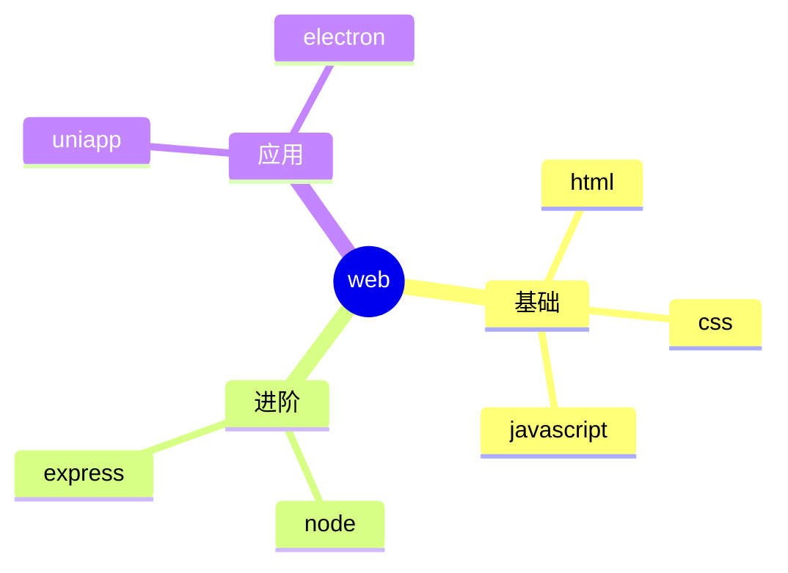

 
###### 24091701
 
<br/>
 
# vitepress中使用思维导图


## 1. 集成 mermaid 

### 1.1 使用参考

这个比较简单，`mermaid.js` 也支持思维导图，但是非常的简陋  

可以参考 👉 [vitepress中使用流程图](./24090601%20Vitepress中使用流程图.md){target="_blank"}

不重复编写了，原理一模一样，用 `mindmap` 替代 `flowchart`即可

**然后使用思维导图的语法就行**  

语法文档： https://mermaid.js.org/

### 1.2. 示例用法

--- 

<pre>

</pre>

--- 

### 1.3 效果演示

- 可以明显地看出，虽然集成简单，但是不怎么实用
- `mermaid` 还是合适简单的可视化需求


## 2. 集成 xmind 预览

### 2.1 参考文章

可以参考这篇大佬的文章

https://juejin.cn/post/7265112695837655080

> `xmind官网` https://xmind.cn/

### 2.2 题外话

这个看上去不错，很合适正在使用 **xmind** 的用户  

但我没用过，专门为思维导图去使用它，  

会增加了我笔记库的维护成本  

类似的效果，对于我这种WPS用户完全可以靠嵌入网页来实现 👇  

```html
<iframe src="你的WPS文档的分享链接"></iframe>
```
不过，我更想通过 `js库 `来实现它 


## 3. 集成 G6   

::: danger <Badge type='warning'>警告</Badge>
尝试失败，期盼有大佬出手解决
:::

https://g6.antv.antgroup.com/manual/getting-started

### 3.1 安装依赖

```shell
pnpm install --save @antv/g6 
```


