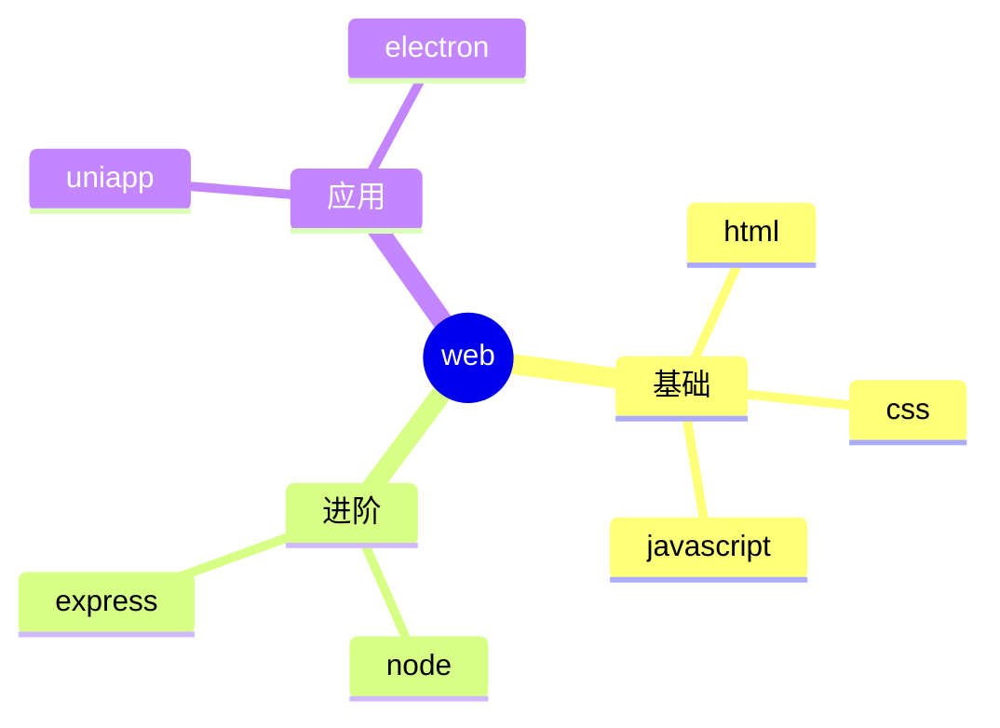

 
###### 24091701
 
<br/>
 
# vitepress中使用思维导图


## 1. 集成 mermaid 

### 1.1 使用参考

这个比较简单，`mermaid.js` 也支持思维导图，但是非常的简陋  

可以参考 👉 [vitepress中使用流程图](./24090601%20vitepress中使用流程图.md){target="_blank"}

不重复编写了，原理一模一样，用 `mindmap` 替代 `flowchart`即可

**然后使用思维导图的语法就行**  

语法文档： https://mermaid.js.org/

### 1.2. 示例用法

--- 

<pre>

</pre>

--- 

### 1.3 效果演示

- 可以明显地看出，虽然集成简单，但是不怎么实用
- `mermaid` 还是合适简单的可视化需求


## 2. 集成 xmind 预览

https://juejin.cn/post/7265112695837655080

https://xmind.cn/


```shell
pnpm i xmind-embed-viewer
```

## 3. 集成 G6   


