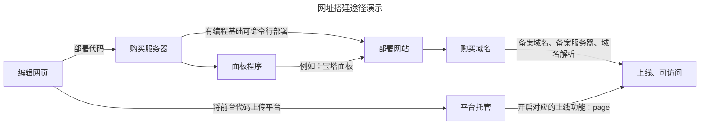

# 建站途径

## 1. 宏观视角

::: danger <Badge type='warning'>提示</Badge>
**一般而言，网站分为`静态网站`与`动态网站`两种。**  

其实静态与动态的差别就是：**有无与数据库的数据交互**。   

:::

搭建一个可访问的网站的方式多种多样，但其实就两个大方向：

**一是，通过自购服务器搭建（动态建站）**  

> 自己买服务器、搭建网站、部署后台  

> `编辑网页` - `购买服务器`- `部署网站`- `购买域名` - `备案、解析、上线`

**二是，通过第三方进行静态网页托管 （静态建站）**  

> 把自己静态网站托管到第三方平台，例如本站是托管在Github上  

> `编辑网页` - `上传平台` - `打开对应的功能上线`

 

 

<Badge type='info'>对比如下</Badge>

||自购服务器|静态网页托管|
|---|:---|:---|
|**代表平台**|`国内`：  阿里云、华为云、腾讯云     `国际`：   cloudflare| `国内`：   Gitee      `国际`：  Github   |
|**相关优势**|有后台、可以数据交互|搭建方便、快速建站|
|**相关劣势**|① 金钱成本（域名、服务器费用）。  ② 技术成本 （后台搭建、服务器运维）|只是静态页面（但个人博客足以）|
|**适合人群**|不差钱且爱折腾、技术党| 学生、白嫖党|
|**备注说明**|其实就是有后台和没后台的区别|

 

 

::: danger <Badge type='warning'>个人建议</Badge>

- 当网站不需要进行数据交互，比如：`评论`、`会员体系`等功能时，静态网站托管是一个很好的选择，只需要把网站代码提交给托管平台，就能拥有自己的网站。  

- 一般而言，实现静态页面托管，主流是`Github Page`，但因为不能言述的原因，大多数人无法访问，所以 `Gitee` 也是不错的选择。 

- 尽管，`Gitee`存在内容审查和实名认证，但是，只要你的博客网站符合社会核心价值观自然是无惧审查。  

:::

::: danger <Badge type='danger'>重要提示-关于Github</Badge>

- 如果你无法访问`Github`，就不必考虑通过Github部署静态页面，当然，你也可以自行百度搜索解决方案。

- 网络不是法外之地，过分的激进不代表清醒，极端的保守也并不是忠诚。

:::

::: danger <Badge type='danger'>重要提示-关于Gitee的吐槽</Badge>

- 审核太费劲，居然要手持身份证，和贷款似的。  

- 都提交实名了，肯定是不折不扣的良民，审核时间十分漫长，不理解为啥这么恶心。  

:::

## 2. 实现视角 

### 2.1 wordpress + 服务器

> 比较经典的建站模式 

