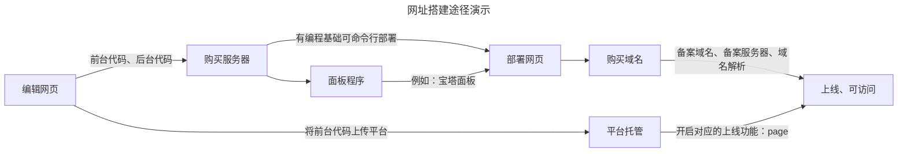

```mermaid
---
title: 网址搭建途径演示
---
flowchart LR
  A[编辑网页] -->|前台代码、后台代码|B[购买服务器]      
  B --> |有编程基础可命令行部署|C[部署网页]
  C --> D[购买域名]
  D -->|备案域名、备案服务器、域名解析|E[上线、可访问]
  A --> |将前台代码上传平台|F[平台托管] -->|开启对应的上线功能：page|E
  B --> H[面板程序] --> |例如：宝塔面板|C
```