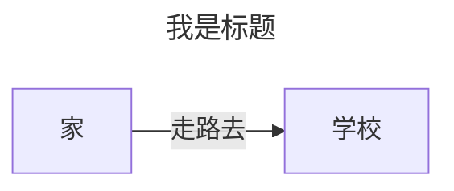
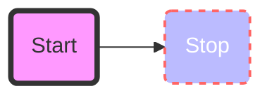

 
###### 24091202
 
<br/>
 
::: danger <Badge type='warning'>警告</Badge>
该文章内容正在建设中......
:::


## 1. 官网

**Mermaid**： https://mermaid.js.org/intro/ <Badge type='tip'>霍格沃茨环境</Badge>


## 2. 基本示例


```markdown
---
title: 我是标题
---
flowchart LR
    A[家] -->|走路去|B[学校]
```


<Badge type='info'>效果演示</Badge>

<br/>




## 3. flowchart 

### 3.？ 样式改变

```markdown
flowchart LR
    id1(Start)-->id2(Stop)
    style id1 fill:#f9f,stroke:#333,stroke-width:4px
    style id2 fill:#bbf,stroke:#f66,stroke-width:2px,color:#fff,stroke-dasharray: 5 5
```

<Badge type='warning'>效果演示</Badge>



